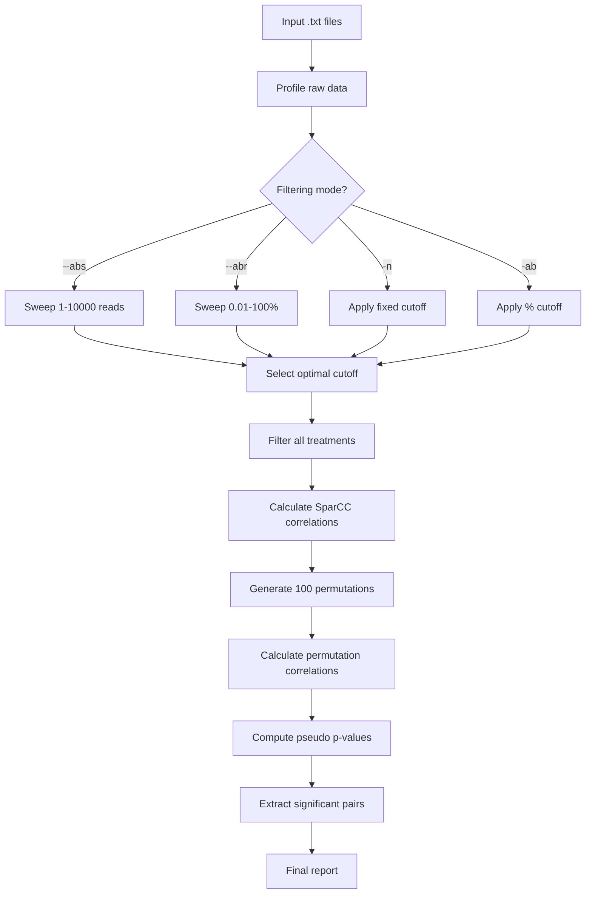

# easy-NET

<p align="center">
  
</p>

# easy_net.sh

A comprehensive bash pipeline for microbial network analysis using SparCC with intelligent ASV filtering based on sum-of-replicates.

## Overview

`easy_net.sh` is an automated pipeline that simplifies SparCC correlation network analysis for microbial community data. It provides flexible filtering strategies to handle large datasets and ensure statistical robustness while maintaining comparability across treatments.

### Key Features

- **Intelligent ASV Filtering**: Multiple filtering modes based on read abundance
  - Automatic sweep for optimal cutoffs
  - Manual threshold specification
  - Ensures ≤999 ASVs per treatment for computational efficiency
  
- **Sum-of-Replicates Logic**: Evaluates each ASV by the total sum across all replicates, providing robust filtering that accounts for biological variation

- **Treatment Comparability**: Applies the same cutoff across all treatments to maintain valid cross-treatment comparisons

- **Automated SparCC Workflow**: Handles the complete pipeline from correlation calculation through permutation testing to significance extraction

- **Comprehensive Logging**: Detailed logs with treatment profiles before/after filtering and success/failure reports

- **Automatic Patching**: Fixes common SparCC compatibility issues automatically

## Requirements

### Software Dependencies

- **Bash** ≥4.0
- **Python** 3.x
- **SparCC** - [Download from GitHub](https://github.com/JCSzamosi/SparCC3)
- **Standard Unix tools**: `awk`, `sed`, `grep`

### Python Packages

SparCC requires:
- `numpy`
- `pandas` (if using certain SparCC features)

Install via:
```bash
pip install numpy pandas
```

## Installation

1. **Clone or download this repository**
```bash
git clone https://github.com/yourusername/easy_net.git
cd easy_net
```

2. **Install SparCC**
```bash
git clone https://github.com/JCSzamosi/SparCC3.git
cd SparCC3
# Follow SparCC installation instructions
```

3. **Configure the script**

Edit `easy_net.sh` and update the SparCC path:
```bash
SPARCC_PATH="/path/to/your/SparCC/"  # Line ~23
```

4. **Make the script executable**
```bash
chmod +x easy_net.sh
```

## Input Data Format

Your input files must be tab-delimited `.txt` files with:
- **First row**: Header with sample names
- **First column**: ASV/OTU identifiers
- **Remaining columns**: Read counts for each replicate

Example:
```
ASV_ID	Sample1_rep1	Sample1_rep2	Sample1_rep3	Sample2_rep1	Sample2_rep2
ASV001	150	200	180	50	60
ASV002	1000	950	1020	800	850
ASV003	5	8	6	1200	1150
```

## Usage

### Basic Syntax

```bash
bash easy_net.sh -d <folder> [filtering_options]
```

### Filtering Modes

#### 1. Automatic Sweep by Absolute Sum (`--abs`)

Automatically finds the minimum read sum cutoff that keeps ≤999 ASVs in all treatments.

```bash
bash easy_net.sh -d ./my_data --abs
```

- Sweeps from 1 to 10,000 reads
- Selects the lowest cutoff meeting the ASV limit
- Best for datasets with variable sequencing depth

#### 2. Automatic Sweep by Relative Abundance (`--abr`)

Automatically finds the minimum cumulative abundance % that keeps ≤999 ASVs in all treatments.

```bash
bash easy_net.sh -d ./my_data --abr
```

- Sweeps from 0.01% to 100% cumulative abundance
- Keeps top N most abundant ASVs covering ≥X% of reads
- Best for comparing treatments with different total read counts

#### 3. Manual Absolute Threshold (`-n`)

Specify a fixed minimum read sum per ASV.

```bash
bash easy_net.sh -d ./my_data -n 150
```

- Keeps ASVs with total reads ≥ specified value
- Useful when you have a predetermined threshold

#### 4. Manual Relative Threshold (`-ab`)

Specify a fixed minimum relative abundance % per ASV.

```bash
bash easy_net.sh -d ./my_data -ab 0.05
```

- Keeps ASVs representing ≥ specified % of treatment total
- Useful for percentage-based filtering

### Complete Examples

```bash
# Automatic filtering for diverse treatments
bash easy_net.sh -d ./experiment1 --abs

# Relative abundance for normalized comparison
bash easy_net.sh -d ./experiment2 --abr

# Manual threshold with known biology
bash easy_net.sh -d ./experiment3 -n 200

# Low-abundance filtering
bash easy_net.sh -d ./experiment4 -ab 0.02
```

## Output Structure

```
your_data_folder/
├── treatment1.txt
├── treatment2.txt
├── filtered/
│   ├── treatment1.txt (filtered)
│   ├── treatment2.txt (filtered)
│   ├── treatment1_net/
│   │   ├── cor_sparcc.out           # Correlation matrix
│   │   ├── pvals_two_sided.txt      # P-values
│   │   ├── significant_edges.tsv    # Significant correlations
│   │   ├── perm/                    # Permutation files
│   │   └── pvalues/                 # Permutation correlations
│   └── treatment2_net/
│       └── ...
└── easy_net_YYYYMMDD_HHMMSS.log    # Complete pipeline log
```

## Pipeline Workflow



## Understanding the Filtering Logic

### Sum-of-Replicates Approach

Each ASV is evaluated by the **sum of all its replicates**:

```
ASV_sum = replicate1 + replicate2 + replicate3 + ...
```

This approach:
- Captures biological variability across replicates
- Reduces noise from single low-count replicates
- Provides robust abundance estimates

### Why Use the Same Cutoff Across Treatments?

Using a **uniform cutoff** ensures:
- **Valid comparisons**: Networks are comparable across treatments
- **No bias**: Doesn't favor treatments with different sequencing depths
- **Statistical consistency**: Same statistical framework for all analyses

## Command-Line Options Reference

| Option | Type | Description |
|--------|------|-------------|
| `-d <folder>` | Required | Folder containing input .txt files |
| `--abs` | Flag | Auto-sweep absolute sum (1-10000) |
| `--abr` | Flag | Auto-sweep relative abundance (0.01-100%) |
| `-n <int>` | Value | Manual minimum read sum |
| `-ab <float>` | Value | Manual minimum % abundance |
| `-h, --help` | Flag | Display help message |

**Note**: `--abs` and `--abr` are mutually exclusive.

## Troubleshooting

### Common Issues

#### 1. "No cutoff found" error

**Problem**: No cutoff in the sweep range reduces all treatments to ≤999 ASVs

**Solutions**:
```bash
# For --abs mode: use manual mode with higher threshold
bash easy_net.sh -d ./data -n 15000

# For --abr mode: consider if your data has too many high-abundance ASVs
# You may need to adjust max_asv in the script (line ~49)
```

#### 2. "cor_sparcc.out is empty" error

**Problem**: Input file format issues

**Diagnosis**:
```bash
# Check file format
head -2 your_file.txt | cat -A

# Should show tab characters as ^I
# Bad: spaces instead of tabs
# Bad: extra tabs between values
```

**Solution**: Ensure proper tab-delimited format with no empty fields

#### 3. SparCC path not found

**Problem**: Script can't locate SparCC installation

**Solution**:
```bash
# Edit line ~23 in easy_net.sh
SPARCC_PATH="/correct/path/to/SparCC/"
```

#### 4. Permutation failures

**Problem**: Some permutations fail during processing

**Impact**: Moderate - a few failed permutations out of 100 won't significantly affect results

**Action**: If >20 permutations fail, check input data quality

## Performance Notes

- **Automatic sweep** (--abs/--abr): Slower but optimal
  - Runtime: 30s - 2min depending on data size
  
- **Manual threshold**: Faster
  - Runtime: Instant filtering

- **SparCC analysis**: Most time-consuming step
  - Per treatment: 2-10 minutes
  - 100 permutations: 20-60 minutes per treatment
  - Scales with ASV count (hence the 999 ASV target)

## Citation

If you use this pipeline, please cite:

**SparCC**:
```
Friedman, J., & Alm, E. J. (2012). 
Inferring correlation networks from genomic survey data. 
PLoS computational biology, 8(9), e1002687.
```

**This pipeline**:
```
[Your citation information here]
```

## Advanced Configuration

### Changing the ASV Limit

Edit line ~49 in the script:
```bash
max_asv=999  # Change to your desired limit
```

Higher limits:
- ✓ More comprehensive networks
- ✗ Longer computation time
- ✗ Potentially more false positives

### Modifying Sweep Ranges

**For --abs mode** (line ~339):
```python
for cut in range(1, 10001):  # Change upper limit
```

**For --abr mode** (line ~409):
```python
step = 0.01  # Change step size
cut = 100.0  # Starting point
```

### Adjusting Permutation Count

In the SparCC loop (line ~621):
```bash
for f in $(seq 0 99); do  # Change to 0-499 for 500 permutations
```

## Contributing

Contributions are welcome! Please:

1. Fork the repository
2. Create a feature branch (`git checkout -b feature/AmazingFeature`)
3. Commit your changes (`git commit -m 'Add some AmazingFeature'`)
4. Push to the branch (`git push origin feature/AmazingFeature`)
5. Open a Pull Request

## License

[Specify your license here - e.g., MIT, GPL-3.0, etc.]

## Contact

[Your contact information]

## Acknowledgments

- **SparCC developers**: Jonathan Friedman and Eric Alm
- **Contributors**: [List any contributors]

---

## Quick Start Checklist

- [ ] SparCC installed and working
- [ ] Path configured in script
- [ ] Input files tab-delimited with proper format
- [ ] Script made executable (`chmod +x`)
- [ ] Test run: `bash easy_net.sh -d ./test_data --abs`
- [ ] Check output in `filtered/` folder
- [ ] Review log file

**Questions?** Open an issue or check the troubleshooting section above.
